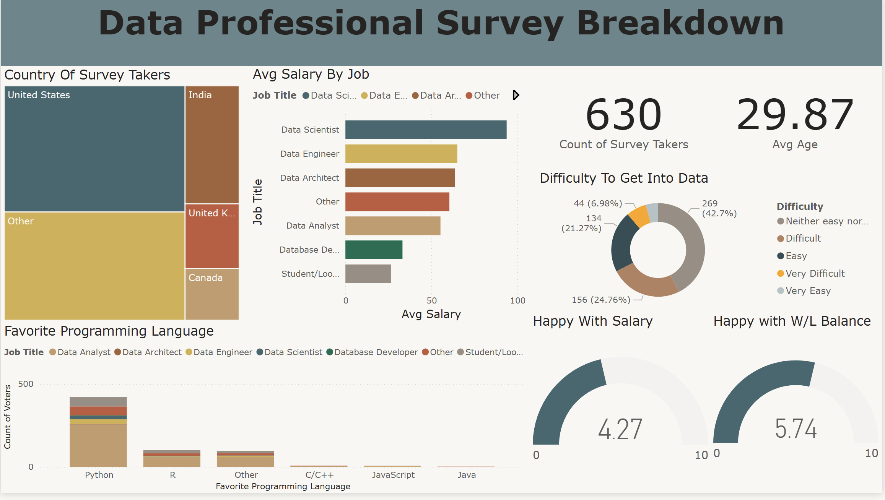

# PowerBi-Data-Professional-Survey

# 📊 Data Professional Survey (Power BI)

## 📚 Overview
The **Data Professional Survey Breakdown** is an interactive Power BI dashboard built to analyze a real-world survey of **630 data professionals**.  

It focuses on **salary trends, job roles, programming language preferences, and workplace happiness**, helping stakeholders quickly identify:
- Role-based salary patterns  
- Popular programming languages  
- Geographic distribution of professionals  
- Levels of work-life and salary satisfaction  

Advanced Power Query transformations, DAX measures, and clear visualizations ensure a **user-friendly, executive-ready experience**.

---

## 🖼 Report Preview

---

## 🎯 Key Features
- **KPI Cards** – Displays total survey respondents and average age (~30 years)  
- **Salary Analysis** – Stacked bar charts showing highest salaries by role and location  
- **Programming Language Popularity** – Column chart highlighting most popular languages (Python, R, SQL)  
- **Happiness Gauges** – Visualizes work-life balance and salary satisfaction on a 0–10 scale  
- **Demographic Breakdown** – Tree-maps for geographic distribution and charts showing difficulty entering the field  

---

## 🛠 How It Was Built
- **Data Sources:** CSV file from LinkedIn, Twitter, and other survey platforms  
- **Data Prep:** Power Query for job title standardization, salary normalization, language grouping, and geographic filtering  
- **Modeling:** DAX measures for average salary, role-based comparison, and happiness metrics  
- **Visuals:** KPI cards, stacked bars, column charts, tree-maps, and segmented charts designed for clarity  

---

## 🚀 Outcome
- Fully interactive **Power BI dashboard** from raw survey data to actionable insights  
- Highlights **salary trends, programming language popularity, and geographic impact**  
- Provides clear visibility into **workplace satisfaction and role-based patterns**  

---

## 📝 Conclusion
The **Data Professional Survey Breakdown** demonstrates how survey data can be transformed into **clear, actionable insights**. It reveals trends in **salary, job roles, programming language preferences, and workplace happiness**, offering a comprehensive view of the current data professional landscape.
